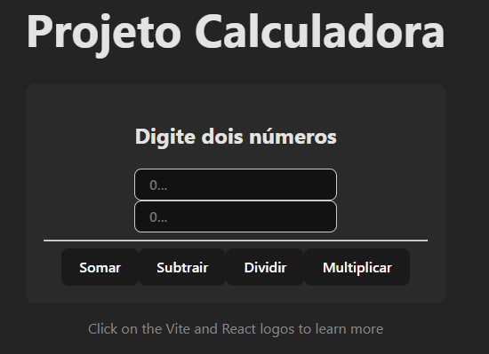

# React + Vite

## Para iniciar o Projeto use os seguintes comandos:

```bash
$ npm create vite@latest
``` 
- Siga os passos que o terminal irá de pedir (De enter para instalar o vite, nome do projeto, biblioteca usado (React)).


```bash
$ npm install
``` 


```bash
$ npm run dev
``` 

### Informações uteis para o projeto

- Crie uma pasta chamada component
- O nome do component precisa começar com letra maiuscula e a função precisa ter o mesmo nome do arquivo.

## Enunciado do exercicio de Calculadora

- Crie dois inputs para receber 2 numeros.
- Crie um botão que irá executar a conta.
- Exiba no alert o resultado.


## Tela dos 3 exercicios

<div> 
 
</div>